# 像素潮 / PixTides · 设计方案

> 本文件同步自 Claude Docs 设计文档（2026-10-07 版）。线上原文：https://claude.ai/code/artifact/e3f6623c-2d78-4a75-82cf-66a9cf62e492
> 两边有出入时以最新讨论为准，改动后请同步更新本文件。

## 1. 定位与目标

纯前端、实时生成的像素风自然风景站：每张图都由代码现场画出，同一种画风，无限随机，可调可下载可分享。起点是已经验证过的蓝色海面画风，扩展到多色渐变的自然场景。

- **一句话**：选一个画面，掷骰子，调到喜欢，下载当头像或壁纸。
- **用户**：全球，想要好看又独特头像、壁纸的普通人；不需要会设计，不需要注册。
- **差异点**：不是图库，是生成器。每张图有编号（短码），别人打开分享链接看到的是同一张，也能在它基础上继续改。
- **成本**：没有服务器渲染、没有图片存储，全部在浏览器里算，部署在静态托管上几乎零成本。

第一版成功标准：首页打开 2 秒内看到会动的像素画面；4096 px 以上 PNG 和 SVG 导出在手机上可用；分享链接能还原同一张图。

## 2. 名称、域名与仓库

- 中文名：像素潮；英文名：PixTides
- 域名：pixtides.com（已在腾讯云注册；pixeltides.com 已被他人注册）
- 仓库：`wenjinliuu/pixtides`，公开

## 3. 画风规范

所有画面共用一套硬规则，保证整站像同一个画师画的；画面之间只换构图和配色。规则从三张蓝色海面参考图提炼（参考实现见 `design/reference/pixel-sea.html`）。

1. **双层网格**：主网格 G 格（默认 32），绘制用 2G 的半格网格。色带边界按整格走，散落方块可以落在半格上，所以方块大小不一是天然的。
2. **色带是主体**：画面由 5–8 条色带组成，边界是随机游走的阶梯线，平台长短不一，相邻色带允许轻微交错，形成嵌入的"岛"。
3. **散落方块**：大小 1–2.5 格，颜色取相邻 1–3 级色带；深区点亮色、浅区点深色；约 1/5 成对出现（对角相连）。
4. **纯色无抗锯齿**：不用透明度、模糊、描边，每个格子就是一个纯色值。这条决定了 SVG 能做到无损。
5. **调色板 = 5–8 个色阶**：在 OKLCH 空间里插值生成，亮度均匀递进，饱和度保持高（参考图从 `#0009F1` 到 `#A4F9FD`）。多色画面用 2–3 个锚点插值，例如蓝调时刻 = 靛蓝 → 蓝紫 → 粉紫。
6. **物体也是色块**：月亮、山、树、帆船用同一网格画成简单剪影，不出现细线条和文字。

底线：任何画面缩成 64 px 头像时仍能认出主色和大结构。

参考图主色（从原图量化得到）：

| 参考图 | 色阶（深 → 浅） |
| --- | --- |
| 浅滩 | `#0009F1` `#064EFE` `#1696FD` `#58DAFD` `#97F8FC` `#A9FBFD` |
| 斜浪 | `#000FE8` `#0559FE` `#118DFE` `#59D3FD` `#83EDFD` `#A5F9FD` |
| 潮汐 | `#0113EE` `#0E53FE` `#1E8CFD` `#4DC6FD` `#8BEEFD` `#A3F8FD` |

### 剪影的生成方式

全部由程序生成，用"骨架 + 约束随机"保证每次不同但一定像。骨架是认出这个东西必需的特征，固定不变；其余细节在限定范围里随机。

| 剪影 | 固定骨架 | 随机范围 |
| --- | --- | --- |
| 帆船 | 船身底窄上宽、桅杆竖直、帆在桅杆一侧 | 船身长 6–12 格、船头尖或圆、1–2 根桅杆、帆为三角或梯形、远近大小 |
| 灯塔 | 下宽上窄的塔身、顶部灯室、塔身横条纹 | 高宽比、条纹数、有无基座和光束 |
| 月亮 | 圆形或弯月 | 月相、大小、表面暗斑、光晕圈数 |
| 山 | 底边贴地、山脊向上 | 山峰数、陡峭度、是否积雪、前后层数 |
| 树 | 树干在下、树冠在上 | 针叶 / 阔叶、高度、树冠块数 |

每种剪影先做 1 个生成器，用固定种子出 50 张检查"像不像"，不像的就收紧参数范围。

## 4. 场景库

第一版 6 大类、36 个画面。每个画面 = 构图类型 + 2–3 个配色锚点，引擎插值出完整色阶；同一画面可切换晨 / 昼 / 昏 / 夜色板变体（默认昼；晨、昏按最美时刻统一换色，夜按画面手配，均含该时刻的反光色；各取这段时间最好看的一刻，昏 = 蓝调时刻）。锚点按从起点到终点的顺序写。

构图类型：**横带**、**斜带**、**竖带**、**径向**（同心扩散）、**横带 + 剪影**、**横带 + 光点**（星星、萤火、雪花）。

| 分类 | 画面 | 构图 | 配色锚点 |
| --- | --- | --- | --- |
| 海与水 | 浅滩 | 横带 | `#0009F1` → `#1696FD` → `#A4F9FD` |
| 海与水 | 斜浪 | 斜带 | `#000FE8` → `#118DFE` → `#A5F9FD` |
| 海与水 | 潮汐 | 斜带 | `#0113EE` → `#4DC6FD` → `#A3F8FD` |
| 海与水 | 深海 | 横带 + 光点 | `#3EC0FD` → `#000DEB` → `#020338` |
| 海与水 | 珊瑚礁 | 横带 + 光点 | `#0FB8D8` → `#38E0C8` → `#FF8FA8` |
| 海与水 | 月下海 | 横带 + 剪影 | `#020442` → `#1A3A9E` → `#C8D8FF` |
| 海与水 | 冰湖 | 径向 | `#E8FEFF` → `#7FD8F0` → `#2A6FB8` |
| 海与水 | 涟漪 | 径向 | `#C2FCFE` → `#148FFD` → `#02087A` |
| 海与水 | 瀑布 | 竖带 | `#000DEB` → `#3EC0FD` → `#C8FDFF` |
| 天空与光 | 晴空 | 横带 | `#0A63FE` → `#7AE6FD` → `#E6FEFF` |
| 天空与光 | 蓝调时刻 | 横带 | `#140A6E` → `#4B3FD8` → `#C48BE8` |
| 天空与光 | 日出 | 横带 + 剪影 | `#2A1B6E` → `#FF7A59` → `#FFD66B` |
| 天空与光 | 日落 | 横带 | `#FF9A3D` → `#F0477A` → `#5A1F8C` |
| 天空与光 | 极光 | 竖带 + 光点 | `#03142E` → `#18D6A0` → `#9A5CFF` |
| 天空与光 | 星夜 | 横带 + 光点 | `#020442` → `#000DEB` → `#58DAFD` |
| 天空与光 | 银河 | 斜带 + 光点 | `#05031F` → `#3B2A8C` → `#F2C9FF` |
| 天空与光 | 积云 | 横带 | `#3D8BFF` → `#BFE3FF` → `#FFFFFF` |
| 大地与山 | 远山 | 横带 + 剪影 | `#2B3A6B` → `#7D93C9` → `#E3ECFF` |
| 大地与山 | 雪山 | 横带 + 剪影 | `#F6FBFF` → `#9FC6EE` → `#3A5DA8` |
| 大地与山 | 沙丘 | 斜带 | `#FFE29A` → `#F2A24A` → `#A6522A` |
| 大地与山 | 峡谷 | 横带 | `#F7B07A` → `#C9542E` → `#5E1E1E` |
| 大地与山 | 熔岩 | 径向 | `#FFE15A` → `#FF5A1F` → `#1E0A0A` |
| 植物与季节 | 森林 | 竖带 | `#0B2E1E` → `#2F8F4E` → `#B8F27A` |
| 植物与季节 | 春樱 | 横带 + 光点 | `#FFF4F8` → `#FFB7CF` → `#E5578A` |
| 植物与季节 | 秋林 | 斜带 | `#FFD25A` → `#F07A2A` → `#8C2A1E` |
| 植物与季节 | 麦田 | 横带 | `#5FB8FF` → `#FFE6A0` → `#D99A2B` |
| 植物与季节 | 薰衣草 | 横带 | `#C9B8FF` → `#8A63D8` → `#3E7A3A` |
| 植物与季节 | 苔原 | 径向 | `#E6FFD8` → `#6CC98A` → `#14503C` |
| 天气与时刻 | 晨雾 | 横带 | `#F2F4FA` → `#B8C3DE` → `#6D7DA8` |
| 天气与时刻 | 雨夜 | 竖带 | `#0E1530` → `#2F4A80` → `#8FB2E0` |
| 天气与时刻 | 雪夜 | 横带 + 光点 | `#0B1640` → `#3A5DA8` → `#FFFFFF` |
| 天气与时刻 | 雷暴 | 斜带 + 光点 | `#140B2E` → `#5A3FA0` → `#FFE45A` |
| 天气与时刻 | 彩虹 | 径向 | 红 → 橙 → 黄 → 绿 → 蓝 → 紫（6 锚点特例） |
| 心情 | 单色 | 任意 | 选一个色相，自动出 7 阶 |
| 心情 | 霓虹 | 斜带 | `#14002E` → `#FF2BD6` → `#2BF5FF` |
| 心情 | 薄荷奶油 | 横带 | `#FFF8E6` → `#BFF2DC` → `#4FC9A8` |

锚点是起始建议，落地时每个画面都要在真机上调一遍。

## 5. 生成引擎架构

引擎是一个纯函数：场景定义 + 用户参数 + 种子 → 格子矩阵。矩阵只存每格的色阶编号；预览、动画、PNG、SVG、分享预览图都是它的不同"渲染器"，所以输出永远一致。

```mermaid
flowchart TD
  S[场景定义<br/>构图、色板锚点、默认参数] --> G
  P[用户参数<br/>粒度、比例、起伏、散点] --> G
  R[随机种子<br/>写进分享链接] --> G
  subgraph G[生成器 generate&#40;&#41;]
    G1[色阶插值 OKLCH] --> G2[色带边界 随机游走阶梯] --> G3[岛与补丁] --> G4[散落方块] --> G5[剪影与光点]
  end
  G --> M[格子矩阵<br/>每格一个色阶编号]
  A[动画器<br/>逐帧改少数格子] --> M
  M --> O1[Canvas 渲染 预览与 12 fps 动画]
  M --> O2[PNG 导出 整数像素对齐]
  M --> O3[SVG 导出 同色合并矩形]
  M --> O4[预览图 Worker 分享卡片图]
```



加新画面只需写一个场景定义文件，不改引擎：

```ts
export default defineScene({
  id: 'blue-hour',
  name: { zh: '蓝调时刻', en: 'Blue Hour' },
  category: 'sky',
  layout: 'bands',            // bands | diagonal | vertical | radial
  angle: 92,
  anchors: ['#140A6E', '#4B3FD8', '#C48BE8'],
  steps: 7,                   // 插值出 7 个色阶
  variants: { dusk: ['#0B0640', '#3A2FB0', '#E89BC8'] },
  terrace: [2, 6],            // 台阶长短（格）
  dots: { density: 1, glow: ['#FFE9F6'] },
  silhouette: null,
  motion: 'drift',
});
```

## 6. 动效设计

原则：**格子只换颜色，不移动、不渐隐**。所有动效都是"某些格子在相邻色阶之间切换"，帧率刻意压到 8–12 fps，保留逐帧颗粒感。

| 构图 | 动法 | 观感 |
| --- | --- | --- |
| 横带 / 斜带 | 每条边界线的游走数组以不同速度缓慢平移，叠加小概率的单格起伏 | 海面在推浪，没有规律地涌动 |
| 竖带 | 游走数组沿竖直方向滚动 | 瀑布、雨、极光往下流 |
| 径向 | 各圈边界基准半径随时间外扩，最外圈消失、中心补新圈；圈的颜色按色阶往返循环（浅→深→浅），相邻圈只差一级 | 涟漪不断扩散 |
| 光点 | 每个光点按自己的相位在两三个色阶间切换 | 星星闪、萤火明灭 |
| 散落方块 | 极少数方块偶尔熄灭，在附近半格处重新出现 | 画面"呼吸" |
| 剪影 | 不动 | 稳定的视觉锚点 |

- **首页**：全屏浅滩，每一浪随机生成；按访问者本地时间切换晨 / 昼 / 昏 / 夜色板（晨 5–9 点、昼 10–16 点、昏 17–19 点、夜 20 点–次日 4 点），切换用"逐格溶解"（随机顺序把格子换成新颜色，约 1 秒）。第一屏画的就是当天的今日一张。浪是时间的纯函数：时间取从 2026-01-01 UTC 起算的秒数（连续不跳），所以同一时刻、同样大小的屏幕，全世界看到的是同一片浪；色板仍按各自的本地时段。第一屏的粒度和编辑区是同一组 8 档（12–128 格），点按钮循环切换，记在本机。编辑区没改动时配色和粒度都跟随第一屏，用户在编辑区自己改了就不再跟随；编辑区始终显示这张图的来源（来自今日一张 / 我的海 · 「名字」…），改过之后变成"改自 …"。编辑区画布上的浪也一直在动（用户只定构图和配色，浪的细小起伏由时间驱动，不参与配方）；导出的是浪静下来的那一刻，与编号一致。
- **画廊卡片**：静止，悬停或按住才动。
- **性能**：只重算变化的格子；页面不可见时暂停；系统开启"减少动态效果"时全部静止。
- **动图导出（V2）**：无缝循环 GIF / MP4。

## 7. 自定义与导出

| 控件 | 层级 | 取值 |
| --- | --- | --- |
| 换一张（骰子） | 常用 | 新种子；可锁定构图只换散点，或锁定配色只换构图 |
| 像素粒度 | 常用 | 12 / 16 / 24 / 32 / 48 / 64 / 96 / 128 格，也可连续调 |
| 画面比例 | 常用 | 1:1、9:16、9:19.5、16:9、16:10、21:9、3:4、4:5 |
| 配色 | 常用 | 场景预设、晨 / 昼 / 昏 / 夜变体（每个时段取这段时间里最好看的一刻做基调：晨 = 柔和的晨光（蓝灰、藕紫、淡玫瑰、淡杏，饱和度压低）；昏 = 蓝调时刻（深钴蓝、群青、薰衣草，地平线一抹粉）；夜 = 海军蓝与月光。晨、昏按每一阶的明暗位置统一换色，保留每个画面自己的明暗结构；夜按画面手配。三个时段都带该时刻的反光 / 发光色（晨的淡金、蓝调时刻的零星暖灯与淡粉、夜里的银白月光和深海荧光），替换一部分散落方块和光点；构图不变，只换颜色。以后每个新画面也按这个原则取它一天中最好看的时刻）、色相整体旋转、自建 2–3 锚点 |
| 渐变方向 | 更多 | 0–359°；径向时拖拽中心点 |
| 浪线起伏 | 更多 | 0–2 |
| 平台长短 | 更多 | 短=碎浪，长=平静 |
| 色带数量 | 更多 | 4–10 |
| 散落方块 | 更多 | 密度 0–3，大小范围，成对比例 |
| 剪影 | 更多 | 开关；换一个 |
| 深浅反转 | 更多 | 开关 |

导出：

- **分辨率**：1080p / 2K / 4K / 5K / 8K 五档。横向比例按长边 1920 / 2560 / 3840 / 5120 / 7680 px，另一边按比例算；竖向比例（9:16、9:19.5、3:4、4:5）按短边 1080 / 1440 / 2160 / 2880 / 4320 px，保证手机壁纸不低于屏幕分辨率；1:1 用 1080 / 2048 / 4096 / 5120 / 8192 px。
- **PNG**：自己编码调色板（索引色）PNG，不经过 canvas，绕过手机浏览器画布上限（iOS 约 4096²）；8K 也只有几百 KB；每格对齐整数像素，格宽除不尽时相邻格子相差 1 px，保持标准尺寸和完整画面；每格小于约 6 px 时提示换高一档。
- **形状**：方形、圆形（圆外透明）、圆角方形；"安全区"开关。选圆形时画面比例自动切到 1:1。
- **SVG**：同色横向合并成长矩形，无限放大。

## 8. 作品编号与分享

每张图的编号就是它的配方：画面 + 种子 + 全部参数，打包成短码，只记录改动过的参数（没碰"更多"时约 10–12 位，全部调过约 20 位），例如 `/p/sh-7kq9zt2mxy3`，页面和图片角落显示为大写分组的 `SH-7KQ9-ZT2M-XY3`。打开链接时引擎按同一配方重画，得到像素级一致的图。

1. 参数按固定顺序写成二进制，开头带引擎版本号，再转 Crockford base32（0–9 加去掉 I、L、O、U 的 22 个字母）。不区分大小写，输入时自动把 O 当 0、I 和 L 当 1，适合印在图上让人照着念、照着敲。
2. 解码在浏览器里完成，不查数据库、不存图片。
3. 旧版本生成器保留在代码里，按短码版本号调用，老链接永远还原原样。
4. 社交平台抓取链接时，Worker 按短码现场画出预览图并缓存。
5. 编号可选印在图片角落，像画作签名。

例外：上传图片做成的作品没有配方，需要存储（见下节）。

### 玩法与同步

所有玩法都建立在"同一编号 = 同一张图"上：任何设备按同一配方都画出同一张，所以不需要服务器和账号，也能让所有人看到同样的东西。

**文字种子规则 v1**（今日一张、我的海共用）

1. 规范化：Unicode NFKC（全角转半角）、去掉首尾空格、连续空格合成一个、英文转小写；日期统一写成 YYYY-MM-DD（支持 2026/10/7、20261007、2026年10月7日 等写法）。名字额外去掉所有空格和常见分隔符（· ・ - _ . ' ’），让"王 小明"="王小明"；繁简、平假名 / 片假名、带重音的字母不合并，名字要区分开。
2. 算 SHA-256("pixtides/v1/<类型>/<规范化文字>")，类型有 day（日期）、name（名字）、md（不含年份的生日 MM-DD）、name+date（名字|日期）。
3. 取前 5 字节（40 位，约 1.1 万亿种，是世界人口的一百多倍）做构图种子；所有图的种子都是 40 位，编号里占 8 位。文字只决定底座构图（色带怎么拐、岛和散落方块放在哪），画面、配色、粒度、起伏等都由用户选。
4. 规则带版本号，发布后永不修改；要改就出 v2，旧编号继续按 v1 算。

| 玩法 | 规则 | 计划 |
| --- | --- | --- |
| 全球同步的海 | 首页第一屏就是今日一张；浪的时间 = 从 2026-01-01 UTC 起算的秒数；同一天的人看到同一张，同一时刻、同尺寸屏幕看到同一片浪；以后画面扩到 36 个，同步的就不只是海 | V0 |
| 今日一张 | 访问者本地日期（年月日）；2026-10-07 为第 1 张，之前的日期也能算；画面每轮把全部画面打乱轮一遍，相邻两天不重复；种子 = 文字种子(day, 日期) | V0 |
| 收集日历 | 在本机记录看过今日一张的日期，攒成月历，缩略图统一用昼色板；平时收在第一屏的"日历"按钮里，点任意一天，第一屏换成那天的海（回看），浪仍全球同步；只存在浏览器里，不需要账号 | V1 |
| 我的海 | 先选画面（不自动挑），再输入名字或一句话 → 文字种子(name)，或生日（含年份 = 那一天今日一张的构图，选同一个画面就是那天的那张；不含年份 = 文字种子(md, 月日)，同一天生日的人共享一张），或名字 + 生日 → 文字种子(name+date)，重名的人也能各有一张；选了画面时种子不变，只换画面；默认用昼色板 | V1 |
| 稀有彩蛋 | 由画面 + 种子决定，约 1/512 出现鲸尾剪影，打开同一编号的人都能看到；以后可加流星、灯塔光束 | V1 |
| 一对头像 | 生成 2:1 的图，左右各取一半，并排时浪是连着的 | V1 |
| 派生关系 | 在别人的图上改动后显示"改自 …"；只在当下显示，不写进编号，改过的图就是一张新的独立作品 | V2 |

## 9. 上传图片转像素

处理全在浏览器里完成，照片不上传服务器。

1. 裁切到所选比例，降采样到 G 格（半格网格 2G）。
2. 在 OKLCH 里聚类，量化成 5–10 个色阶。
3. 套用画风规则：清掉小于 1 格的孤立杂点，色块边缘整理成阶梯，撒散落方块。
4. 得到同样的格子矩阵，后续动画、导出、头像裁切全部复用。

- **配色**：保留原色 / 套用任意场景色板 / 单色。
- **分享**：用户点"分享"时才把格子矩阵（不含原图，32 格不到 1 KB）存进 Cloudflare R2。

**内容安全**（已定：上传作品不进公开画廊，公开内容只由官方挑选）：分享前勾选使用条款；只能通过链接查看且不被搜索引擎收录；作品页有举报按钮，后台一键下架；分享时调用自动审核接口（服务待选）；同一 IP 每天的分享次数有上限。

## 10. 网站结构与页面设计

| 页面 | 路径 | 内容 | 主要动作 |
| --- | --- | --- | --- |
| 首页 | `/` | 首页与编辑器是同一页：第一屏就是全屏的"今日一张"（浪全球同步）+ 站名 + 一句话，带"日历"按钮可回看任意一天；往下滚进入编辑区；再往下是我的海、6 个分类入口 | 调这张、随机一张、调参、下载、复制分享链接 |
| 画廊 | `/gallery`、`/gallery/sky` | 分类标签 + 瀑布流卡片 | 点卡片进编辑器 |
| 编辑器 | `/s/<画面>?seed=…`、`/p/<短码>` | 已并入首页（同一页的编辑状态）；分享链接打开时直接定位到编辑区，旧路径跳转到首页对应的图 | — |
| 关于 | `/about` | 画风由来、生成原理、开源仓库 | — |

视觉方向：

- 界面不抢戏：画是唯一的颜色来源。界面有深色、浅色两套，默认跟随系统，也可手动切换；两套界面色都从当前画面推出（深色用最深色阶做底，浅色用最深色阶做强调色）。第一屏叠在画上的字始终用深色那套。
- 字体：中文 Fusion Pixel（OFL），英文 Silkscreen，正文系统字体。
- 控件方角、粗边的像素风，但不做花哨的游戏 UI。
- 手机优先：首页往下滚就进入编辑区，画布吸顶、控件在下，左右滑画布换下一张；桌面是左画布右面板。
- "今日一张"：用日期做种子，全世界同一天看到同一张。
- 中英双语，第一版就做。

## 11. 技术栈与部署

| 层 | 选择 |
| --- | --- |
| 引擎 | `packages/engine`，纯 TypeScript，无依赖，浏览器与 Worker 共用 |
| 网站 | Astro + Preact 小组件 |
| 绘制 | Canvas 2D，`ImageData` 直接写像素 |
| 托管 | Cloudflare Workers（静态资源 + Workers Builds），推 main 自动部署 |
| 分享预览图 | Worker 路由 `/og/...`，引擎出 SVG，`resvg-wasm` 转 PNG，边缘缓存 |
| 字体 | 像素字体子集化、自己托管；Fusion Pixel 声明了保留字体名，子集必须改名（设计稿用 PixTides Pixel） |
| 测试 | 引擎快照测试（固定种子 → 固定哈希）、Playwright 冒烟截图 |

仓库结构：`apps/web`、`packages/engine`、`packages/scenes`、`workers/og`、`design/`，pnpm workspace。

先行上线（2026-10）：V0 工程搭好之前，先把设计稿的单页（海与水 9 个画面）作为第一版部署出去。`design/tools/build-site.mjs` 把设计稿组装到 `site/`，`wrangler.jsonc` 把它作为 Workers 静态资源发布；Cloudflare 连接 GitHub 仓库后，推送 main 自动部署。V0 工程完成后替换这一版。

部署两步走：

1. **现在**：腾讯云注册的 pixtides.com，DNS 托管到 Cloudflare，网站跑在 Workers 上，不做 ICP 备案（服务器不在大陆，无需备案；国内可访问，速度稍慢）。
2. **以后国内用户多了**：升级双线，境内线路走腾讯云并备案，境外走 Cloudflare。

不采用"腾讯云备案后解析到 Cloudflare"：网站不在备案服务商处会被当成空壳，接入备案可能被注销；个人备案按规定只能是展示类网站，与上传分享冲突。

## 12. 迭代计划

1. **设计稿**：在 `design/` 下做首页与编辑器的可交互原型（单文件 HTML，手机优先），定下视觉风格。不搭工程。
2. **V0**：引擎包、四种构图、首页与编辑器合并的单页、全球同步的海、"今日一张"、深浅两套界面、海与水 9 个画面、全部比例与 1080p–8K PNG / SVG 导出、分享短码、中英双语，部署到 pixtides.com。
3. **V1**：画廊、36 个画面、剪影与光点、分享预览图、上传图片转像素（含内容安全）、我的海、稀有彩蛋、一对头像、收集日历。
4. **V2**：自建锚点配色、锁定骰子、派生关系、GIF / MP4 动图导出。
5. **V3（可选）**：收藏、我的作品、投稿画面定义，用 Cloudflare D1。

## 13. 决策记录（2026-10-07）

| 事项 | 决定 |
| --- | --- |
| 项目名 | 像素潮 / PixTides，域名 pixtides.com，仓库 `wenjinliuu/pixtides` |
| 用户范围 | 全球 |
| 界面语言 | 中英双语，第一版就做 |
| 开源许可 | 代码 MIT；生成的图片归用户，可随意使用，包括商用 |
| 字体 | 中文 Fusion Pixel，英文 Silkscreen；Fusion Pixel 子集改名 PixTides Pixel 后自己托管 |
| 首页 | 全屏浅滩，浪随机涌动，按本地时间切换色板；提前到 V0 |
| 剪影 | 做，全部程序生成，骨架固定、细节随机 |
| 上传图片转像素 | 做；上传作品只链接可见，不进公开画廊 |
| 部署 | 腾讯云域名 + Cloudflare Workers，暂不备案 |
| 导出 | 1080p 到 8K 全覆盖，含圆形与圆角 |
| 导出尺寸 | 横向按长边，竖向按短边，1:1 用 1080 / 2048 / 4096 / 5120 / 8192；格宽除不尽时相邻格子差 1 px，格子小于约 6 px 时提示换高一档 |
| 分享短码 | Crockford base32，不区分大小写，显示为大写分组 |
| 第一版上线 | 2026-10-07 设计稿单页（海与水 9 个画面）上线 pixtides.com：Cloudflare Workers 静态资源，连接 GitHub 仓库，推送 main 自动部署；V0 工程完成后替换 |
| 页面结构 | 首页与编辑器合并成同一页：手机往下滚进入编辑区，桌面左画布右面板 |
| 界面主题 | 深色、浅色两套，默认跟随系统，可手动切换 |
| 玩法 | 全球同步的海、今日一张（本地日期、算法带版本号）、我的海、稀有彩蛋、一对头像、收集日历、派生关系，全部做 |
| 名字规则 | 繁简 / 假名 / 重音不合并；支持名字 + 生日；生日分含年份和不含年份 |
| 派生关系 | 不写进编号，只在当下显示"改自 …" |
| 变现 | 暂不考虑，以后最多加广告 |
| 开工顺序 | 先出设计稿，确认后再搭 V0 工程 |

已完成：Cloudflare 接入域名；设计稿评审（已定稿）；2026-10-07 第一版（海与水 9 个画面）上线 pixtides.com；www.pixtides.com 301 跳转到 pixtides.com（保留路径和查询参数）。

待定：自动审核接口选型（V1 前）。
